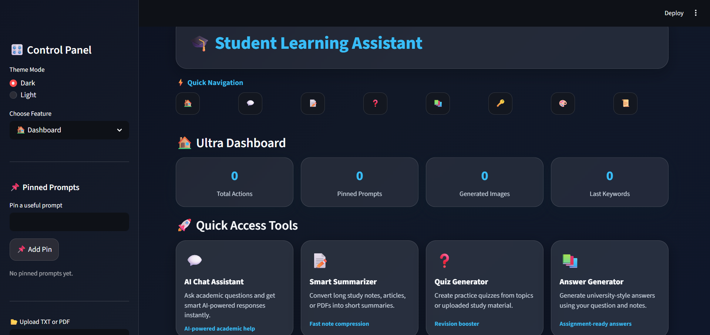
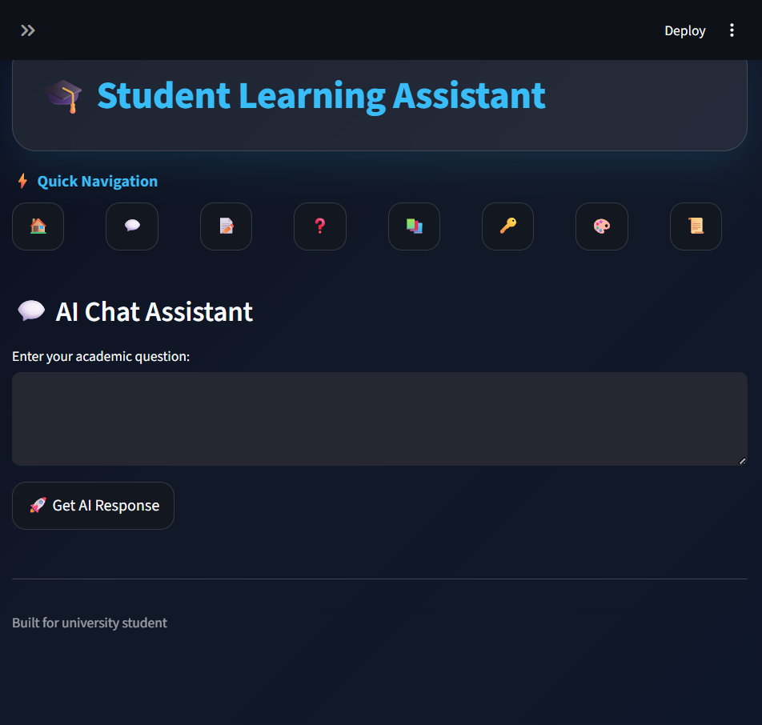
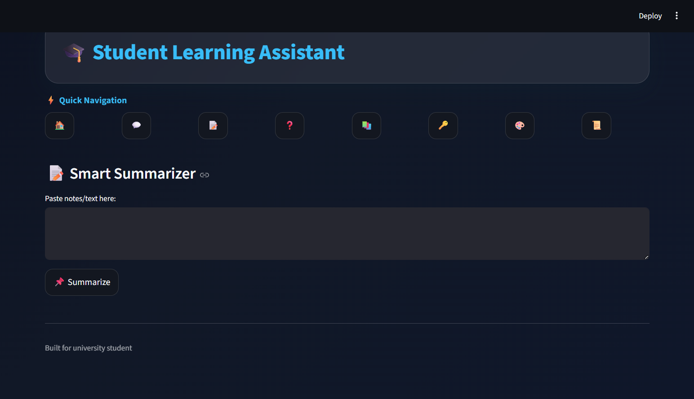

# 🎓 Generative AI Study Assistant

## 📌 Problem Definition
During our studies, we noticed that students often struggle with managing large amounts of study material. Long notes are hard to revise, and creating summaries, important questions, or keywords manually takes a lot of time.

Because of this, students are not always able to prepare efficiently for exams.

---

## 🚀 Solution Overview
To solve this problem, we built a **Generative AI-based Study Assistant** that helps students interact with their study material in a smarter way.

Our application uses **Large Language Models (LLMs)** to:
- Summarize long notes
- Generate quizzes for practice
- Answer academic questions
- Extract important keywords
- Help in writing structured answers

The system is built using **Streamlit**, so everything is available through a simple and interactive web interface.

---

## ✨ Features

- 💬 **AI Chat Assistant**  
  Students can ask academic questions and get AI-generated answers.

- 📝 **Smart Summarizer**  
  Converts long text or PDFs into short and easy summaries.

- ❓ **Quiz Generator**  
  Generates practice questions from any topic or notes.

- 📚 **Answer Generator**  
  Helps in writing structured answers for exams.

- 🔑 **Keyword Extractor**  
  Extracts important keywords for quick revision.

- 🎨 **AI Image Generator**  
  Generates images for presentations and projects.

- 📂 **File Upload Support**  
  Users can upload TXT or PDF files for processing.

- 📊 **Dashboard Analytics**  
  Shows usage insights in a visual format.

- 📜 **History & Export**  
  Saves previous outputs and allows download in JSON/TXT format.

- 📌 **Pinned Prompts**  
  Users can save frequently used prompts.

---

## 🏗️ System Architecture

In our project, we followed a **frontend-backend architecture**.

- The **frontend** is built using Streamlit, which provides the user interface.
- The **backend** is implemented in Python using modular files inside the `utils/` folder.
- For AI functionality, we use **Gemini API / Hugging Face APIs**.

### 🔄 Data Flow
```
User Input (GUI)
   ↓
Streamlit Frontend
   ↓
Python Backend (Utils)
   ↓
LLM API (Gemini / HuggingFace)
   ↓
Generated Response
   ↓
Displayed in Streamlit UI
```

---

## 🛠️ Tech Stack

- **Language**: Python  
- **Frontend**: Streamlit  
- **AI Models**: Gemini API / Hugging Face  
- **Data Handling**: Pandas  
- **Visualization**: Plotly  
- **File Handling**: PDF/Text processing libraries  

---

## ⚙️ Installation & Setup

### 1. Clone the repository
```bash
git clone <your-github-repository-link>
cd student_learning_assistant
```

### 2. Create a virtual environment

#### Windows:
```bash
python -m venv .venv
.venv\Scripts\activate
```

#### macOS/Linux:
```bash
python3 -m venv .venv
source .venv/bin/activate
```

### 3. Install dependencies
```bash
pip install -r requirements.txt
```

### 4. Add API keys

Create a `.env` file in the root folder and add:

```
HUGGINGFACE_API_KEY=your_api_key_here
GEMINI_API_KEY=your_api_key_here
```

---

### 5. Run the application
```bash
streamlit run app.py
```

---

### 6. Open in browser
```
http://localhost:8501
```

---

## 🧑‍💻 How to Use

- Upload notes (TXT/PDF)
- Generate summaries
- Create quizzes for practice
- Ask questions using chatbot
- Extract keywords
- Generate answers
- Create AI-based images
- View and export history

---

## 📸 Screenshots

Example:






---

## 🌐 Important Note

- Internet connection is required for AI features  
- The application uses external APIs (Gemini / Hugging Face)

---

## 🔮 Future Scope

In the future, we can improve this project by adding:
- Voice-based interaction  
- Personalized study recommendations  
- Offline AI model support  
- Integration with learning platforms  
- Mobile-friendly UI  

---

## 👨‍🎓 Academic Relevance

This project helped us understand:
- How Generative AI works in real applications  
- How to integrate LLM APIs into a system  
- How to build a complete application with GUI and backend  
- How to solve real-world problems using AI  

---

## 📄 License
This project is developed for academic purposes.